# SentinelX

**AI-Powered Trust & Safety Investigation & Decision Intelligence Platform**

SentinelX is an investigation workbench for Trust & Safety analysts. Where a typical analytics dashboard answers *"what happened,"* SentinelX answers *"why did it happen, who's responsible, what's the evidence, and what should we do next."*

**🔗 Live demo: [sentinelx-tns.streamlit.app](https://sentinelx-tns.streamlit.app/)**

---

## What it does

The platform begins **after** an alert exists:

```
Alert Generated → Investigation → Evidence → Reasoning → Decision → Action → Resolution
```

An investigator opens a case, sees the account's real signal breakdown, reviews its actual comment/report history and campaign linkage, gets an AI-generated summary and recommendation grounded in that evidence, and resolves the case — every action logged.

**The Overview page** — hero, live database-backed stats, and platform-wide numbers, all queried on page load, not cached:

| 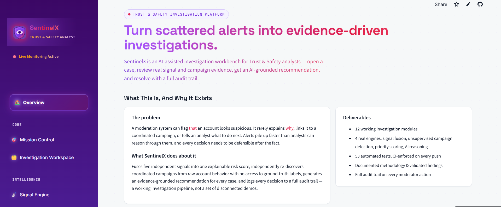 | 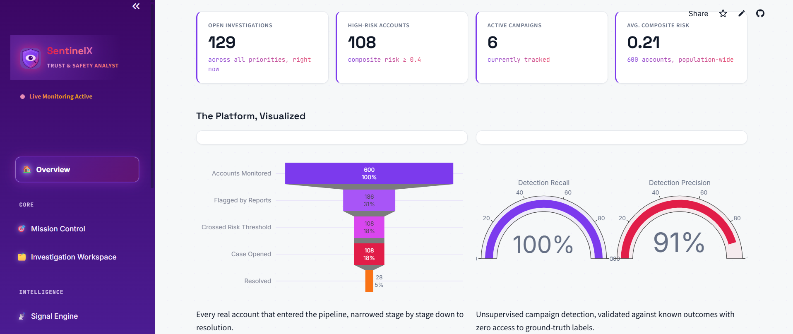 | 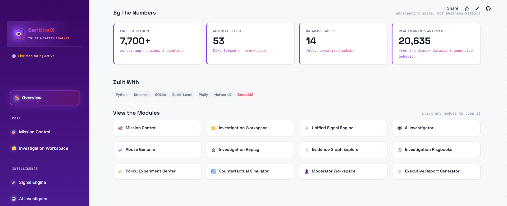 |
|---|---|---|

## The 12 modules

| # | Module | What it does |
|---|---|---|
| 1 | Mission Control | Homepage — active investigations, queue status, priority cases |
| 2 | Investigation Workspace | Core product — open cases, collect evidence, add notes |
| 3 | Unified Signal Engine | Fuses account age, report volume, device reuse, IP clustering, and toxicity into one composite risk score |
| 4 | AI Investigator | Produces Summary + Evidence + Recommendation per case (Groq LLM, or a deterministic evidence-based fallback with zero setup) |
| 5 | Abuse Genome | Campaign "DNA" — velocity, similarity, network density, report volume, visualized per campaign type |
| 6 | Investigation Replay | Timeline reconstruction of how a case actually unfolded |
| 7 | Evidence Graph Explorer | NetworkX graph — Case → Account → Comments/Reports/Campaign |
| 8 | Investigation Playbooks | Case-type-specific investigation checklists |
| 9 | Policy Experiment Center | Live precision/recall/F1 against any risk threshold, computed against real account data |
| 10 | Counterfactual Simulator | "What would've happened under a different policy" — computed from real report/account/timeline data |
| 11 | Moderator Workspace | Assign / Escalate / Resolve / Close, with real business-rule validation and a full audit trail |
| 12 | Executive Report Generator | One-click PDF investigation summary |

## Product walkthrough

### 1. Mission Control

The homepage — open investigation count, high-risk accounts, active campaigns, and average composite risk, live from the database, plus case volume over time and a priority breakdown.

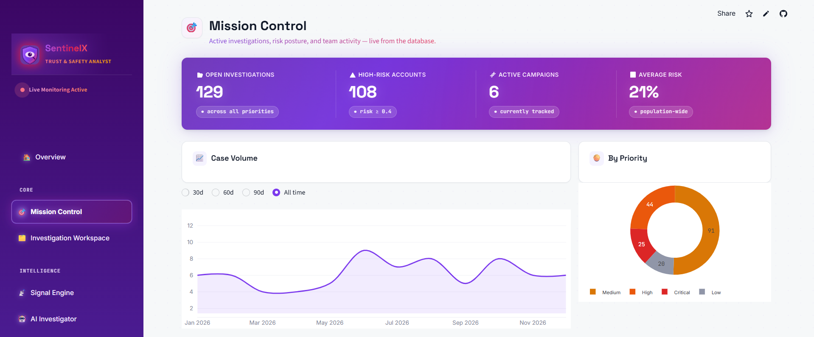

### 2. Investigation Workspace

Search an account, open its case, and land straight on its real risk score, evidence, and signal breakdown.

| 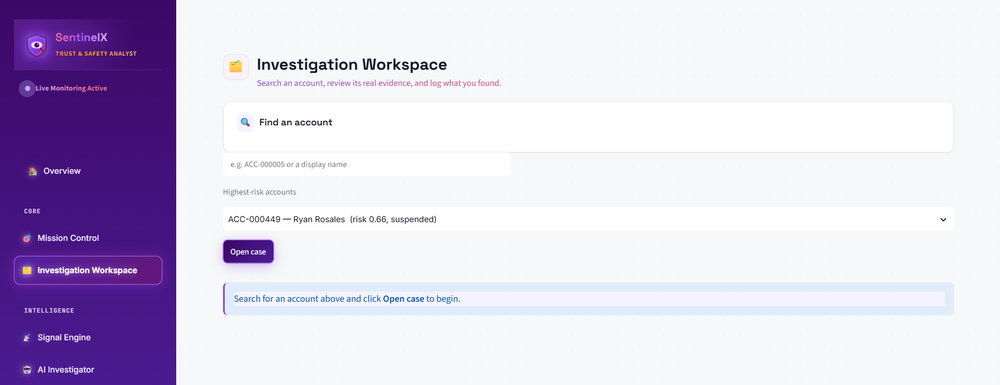 | 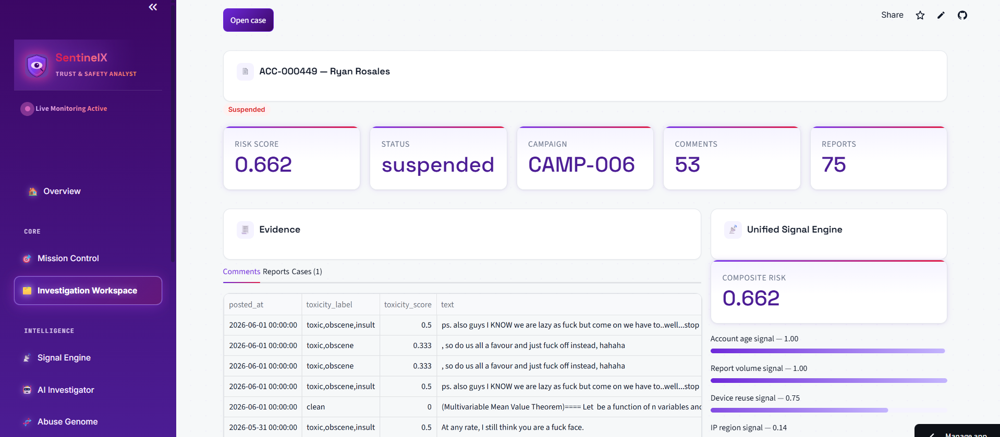 |
|---|---|

### 3. Unified Signal Engine

Five independent signals — account age, report volume, device reuse, IP region, and toxicity — fused into one composite risk score, plus a live "score a hypothetical account" tool that runs the real engine against inputs you type in, not a lookup table.

| 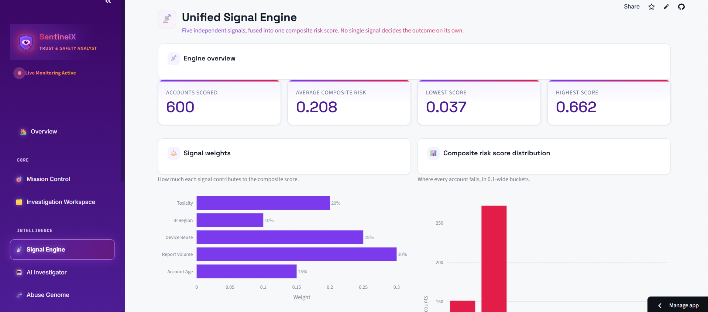 | 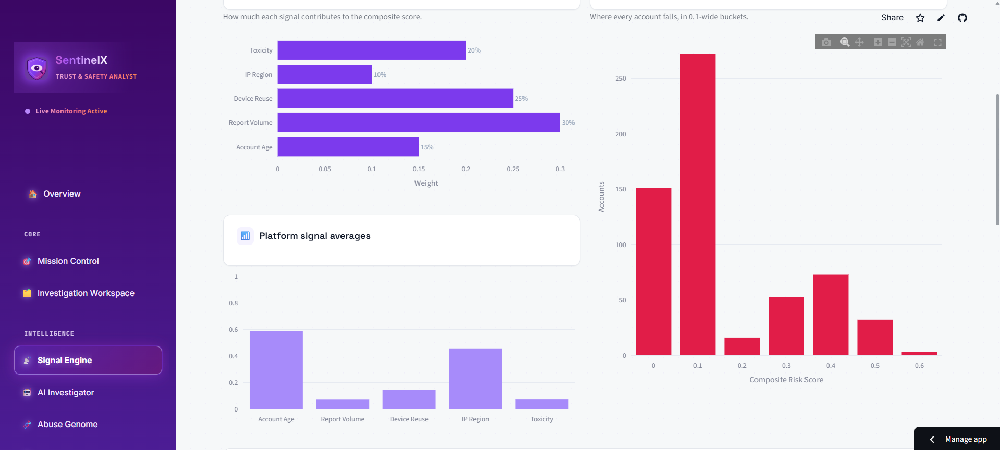 | 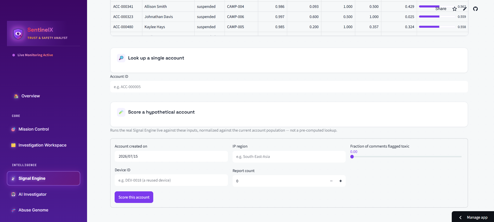 |
|---|---|---|

### 4. AI Investigator

Produces a Summary + Evidence + Recommendation for any case. Runs on Groq's Llama model when a key is configured, or a fully deterministic, evidence-grounded fallback with zero setup — both draw from the same real, computed signal breakdown.

| 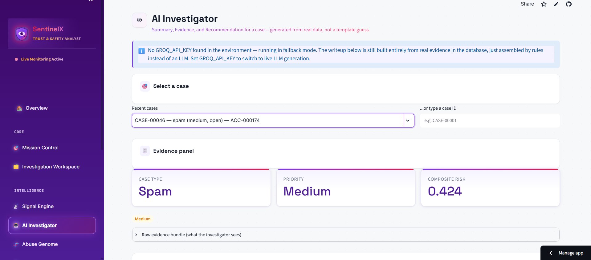 | 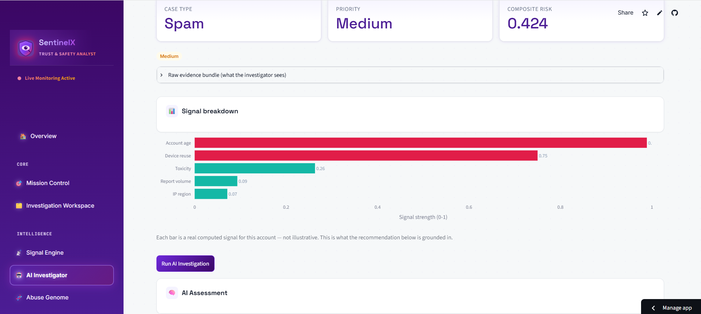 |
|---|---|

### 5. Abuse Genome

Campaign "DNA" — velocity, similarity, network density, and report volume — across every campaign, by campaign type, and drilled into a single campaign, all backed by the unsupervised DBSCAN detector in `src/engines/campaign_engine.py`.

| 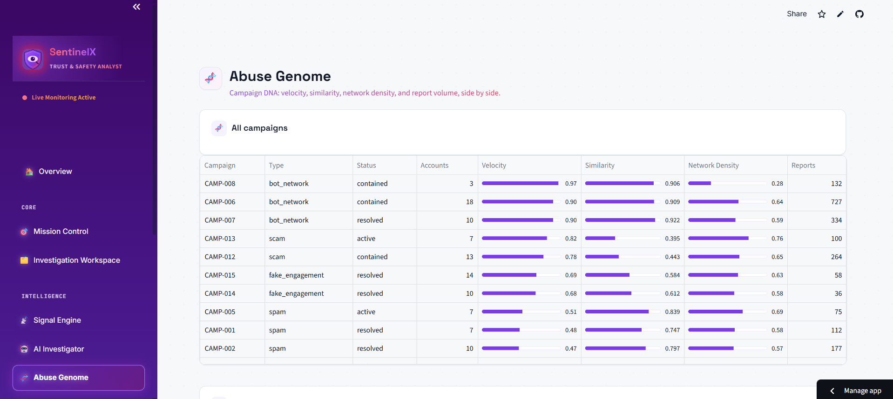 | 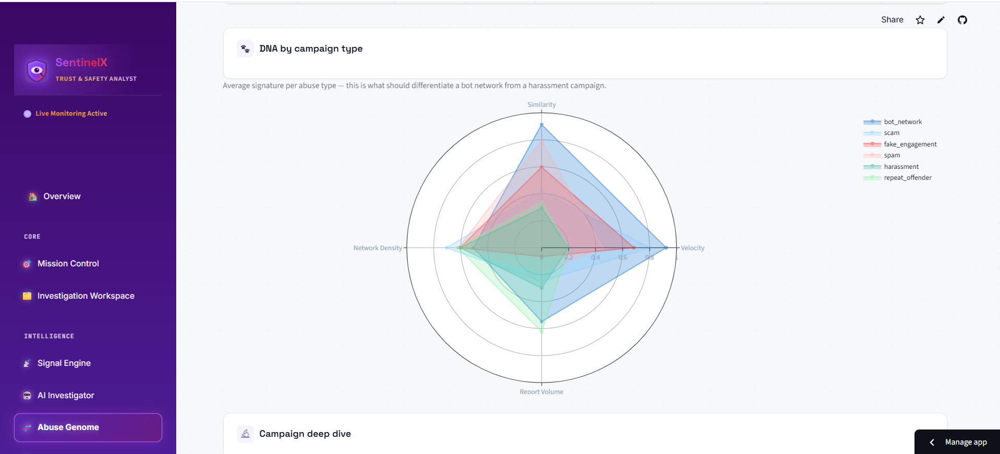 | 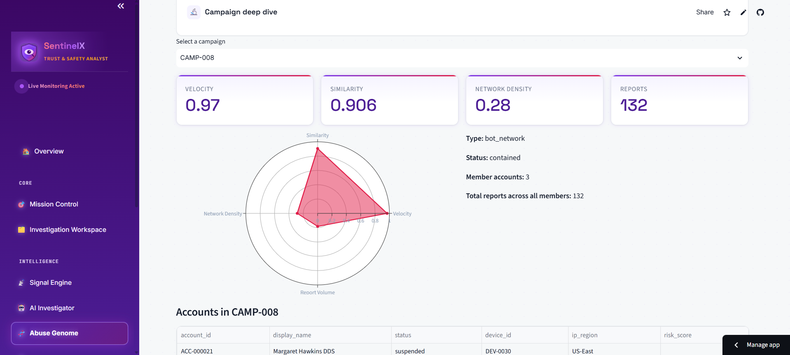 |
|---|---|---|

### 6. Investigation Replay

Step through how a case actually unfolded, from first flag to resolution, reconstructed from real `case_timeline` events.

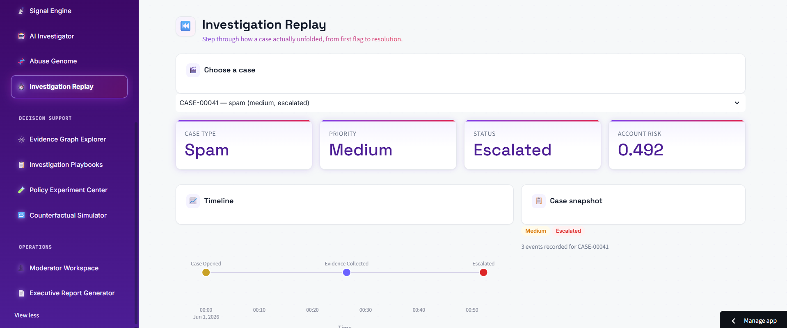

### 7. Evidence Graph Explorer

Case → Account → Comments / Reports / Campaign, rendered as an actual NetworkX connection graph, not a mockup.

| 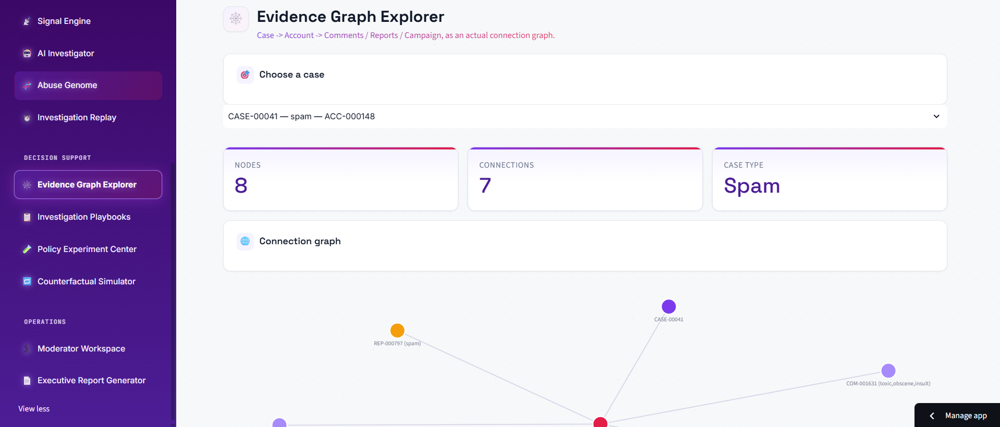 | 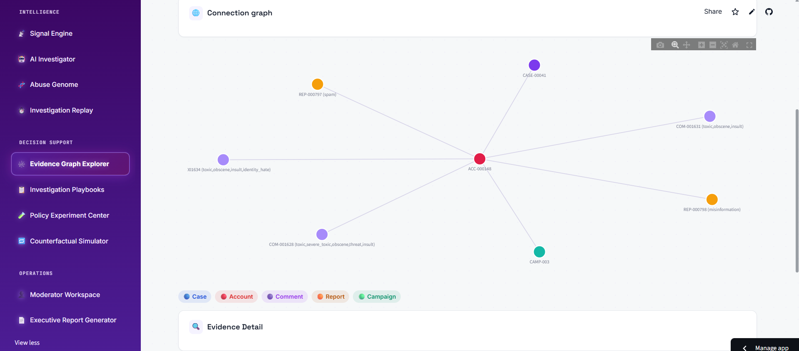 |
|---|---|

### 8. Investigation Playbooks

Case-type-specific recommended steps — a bot-network case gets a different playbook than harassment — alongside real historical outcomes for that case type.

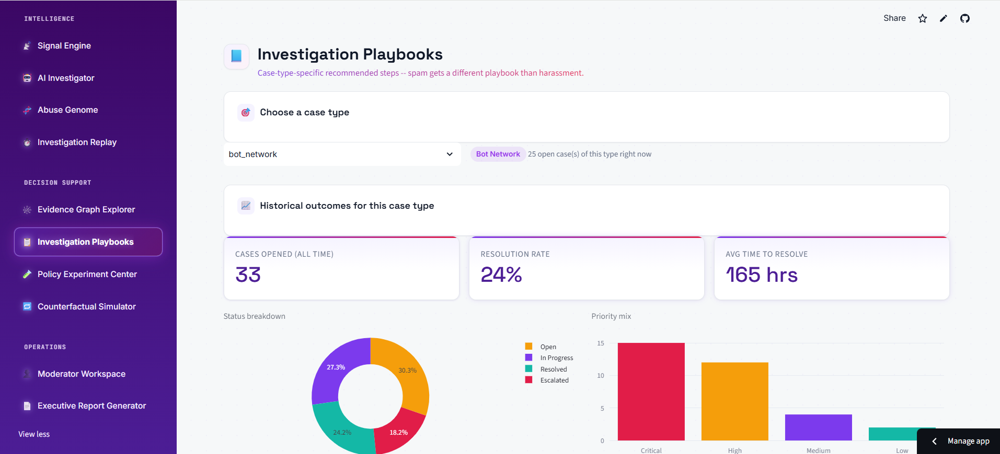

### 9. Policy Experiment Center

What happens to precision and recall if the high-risk threshold moves? Ground truth proxy: accounts confirmed to belong to a real campaign cluster. Pre-recorded experiments, a live slider with a real confusion matrix at any threshold, and precision/recall/F1 plotted across every possible threshold with 95% Wilson confidence bands:

| 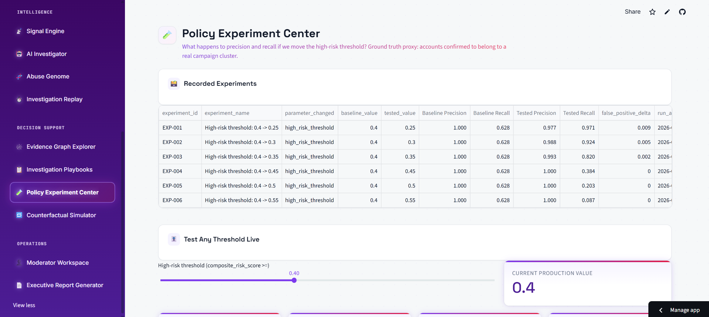 | 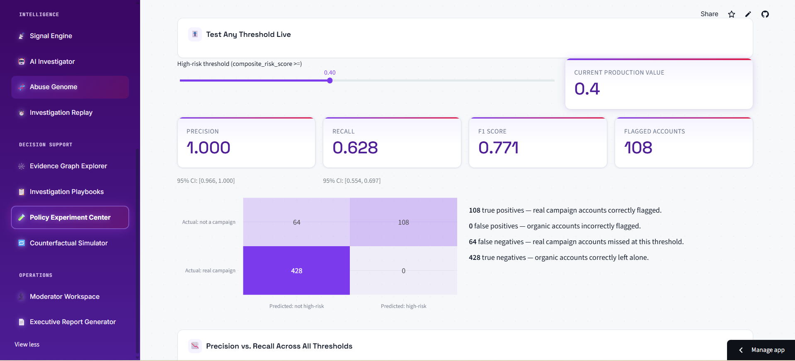 | 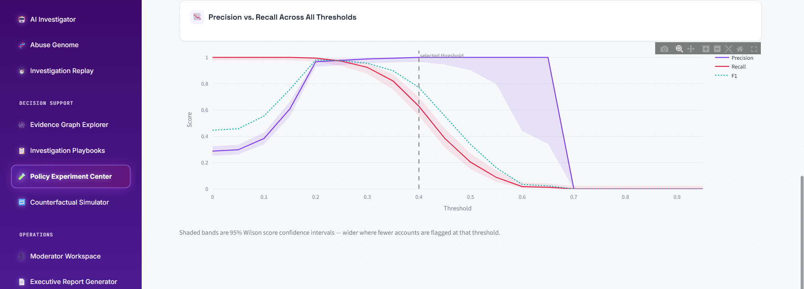 |
|---|---|---|

### 10. Counterfactual Simulator

"What would have happened to real cases under a different policy" — computed directly from real report/account/timeline data, not guessed.

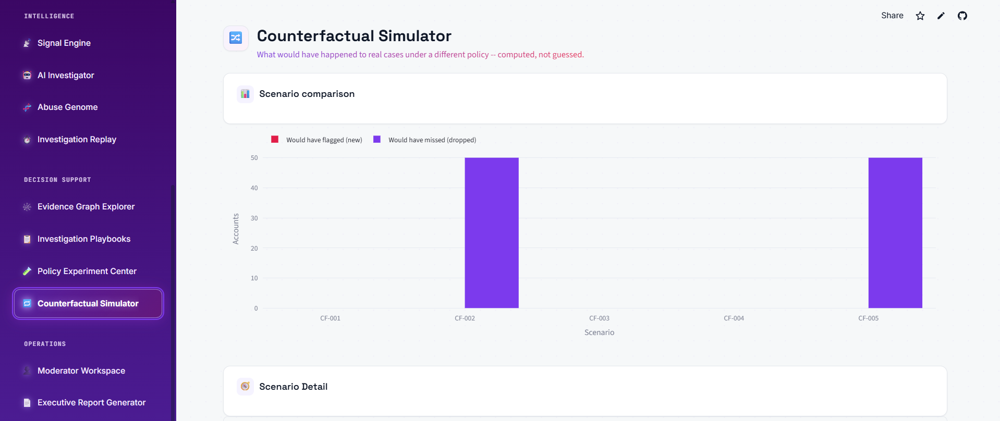

### 11. Moderator Workspace

Assign, escalate, resolve, and close investigations, with real business-rule validation (e.g. a critical case must be escalated before it can be resolved) and a full audit trail. Moderator workload, ranked by active case count:

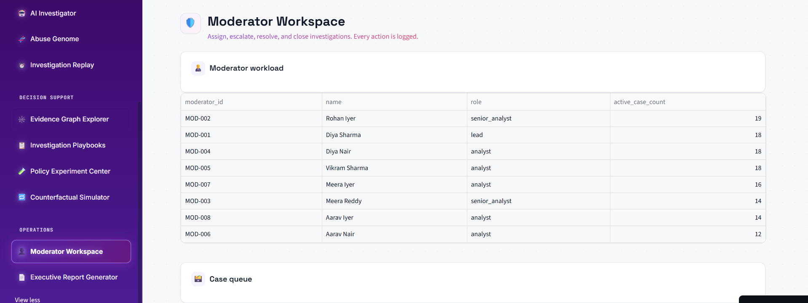

### 12. Executive Report Generator

One-click PDF export of any investigation — signal breakdown, AI assessment, evidence, notes, and audit trail, formatted as a document a manager can actually read.

| 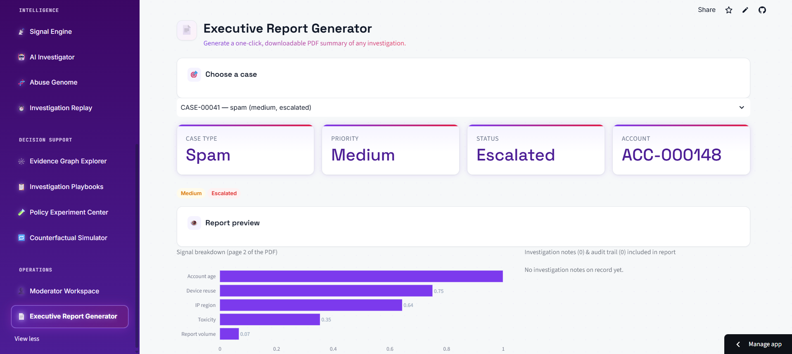 | 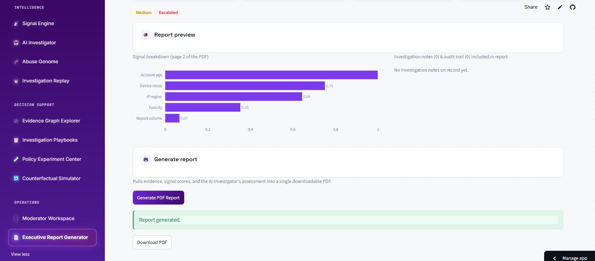 |
|---|---|

## Why the data is defensible

Every number on every page is either **real** (pulled from an underlying real value) or **genuinely computed** — nothing is a hardcoded placeholder:

- Comment text and toxicity labels are **real**, from the [Jigsaw Toxic Comment Classification](https://www.kaggle.com/c/jigsaw-toxic-comment-classification-challenge) dataset (159,571 real Wikipedia talk-page comments).
- Campaign `similarity_score` is **real TF-IDF + cosine similarity** over each campaign's actual comment text — not a random number. See [`METHODOLOGY.md`](METHODOLOGY.md).
- The Unified Signal Engine's five signals are computed from real account age, real report counts, real device-sharing counts, real IP clustering, and real comment toxicity — no `random.uniform()` anywhere.
- The Abuse Genome page's unsupervised campaign detector (`src/engines/campaign_engine.py`) independently rediscovers coordinated clusters using DBSCAN over behavioral features alone, then is scored against the real campaign labels it was never shown. See [`FINDINGS.md`](FINDINGS.md) for the numbers.
- Account/operational metadata (device IDs, IP regions, report timestamps, campaign structure) is synthetic — generated with realistic behavioral clustering, not independent randomness. See `scripts/generate_behaviour.py`.

## Tech stack

Python · Streamlit · SQLite · Pandas/NumPy · Plotly · NetworkX · scikit-learn · Groq (optional, LLM) · ReportLab (PDF)

## Project structure

```
SentinelX/
├── Overview.py                   # Landing page (was app.py -- renamed so the
│                                  #   sidebar nav label reads "Overview")
├── config.py                     # Single source of truth: taxonomy, weights, thresholds
├── assets/screenshots/           # README screenshots
├── data/train.csv                # Real Jigsaw dataset
├── database/sentinelx.db         # SQLite, 14-table schema
├── generated_data/               # Intermediate CSVs from the generator pipeline
├── pages/                        # 12 Streamlit pages, one per module
├── scripts/
│   ├── init_db.py                # Schema (run first)
│   ├── generate_behaviour.py     # Source-of-truth account behavioral profiles
│   ├── generate_campaigns.py     # Campaigns derived from real behavioral clusters
│   ├── generate_accounts.py
│   ├── generate_comments.py      # Real Jigsaw comments, sampled per account's real toxicity profile
│   ├── compute_campaign_similarity.py  # Real TF-IDF cosine similarity
│   ├── generate_reports.py
│   ├── generate_cases.py
│   ├── generate_moderators.py
│   ├── generate_signal_scores.py # Calls src/engines/signal_engine.py
│   ├── generate_case_timeline.py
│   ├── generate_case_evidence.py
│   ├── generate_playbooks.py
│   ├── generate_policy_experiments.py
│   └── generate_counterfactual_runs.py
└── src/
    ├── database/                 # connection, schema constants, data_loader
    ├── engines/                  # signal_engine, campaign_engine (DBSCAN), evidence_engine
    ├── ai/                       # investigator, reasoning_engine
    ├── repositories/             # one per entity/page, raw SQL, real queries
    └── services/                 # investigation_workspace, moderation_service (business rules),
                                    #   report_generator (PDF generation)
```

## Running it locally

### Option A -- just run the app (fastest, no dataset download needed)

`database/sentinelx.db` and every CSV in `generated_data/` are already committed to this repo, fully built. You do **not** need to regenerate anything to see the product:

```powershell
pip install -r requirements.txt
streamlit run Overview.py
```

### Option B -- regenerate the full synthetic dataset from scratch

Only needed if you want to rebuild the data yourself (e.g. to change `config.py`'s weights/thresholds and see the effect end-to-end). This path needs the real Jigsaw Toxic Comment Classification dataset, which is **not** committed to the repo (it's in `.gitignore` -- too large for GitHub):

1. Download `train.csv` from the [Jigsaw Toxic Comment Classification Challenge](https://www.kaggle.com/c/jigsaw-toxic-comment-classification-challenge) on Kaggle (requires a free Kaggle account).
2. Place it at `data/train.csv`.
3. Run the generator pipeline, in order:

```powershell
pip install -r requirements.txt

py scripts\init_db.py
py scripts\generate_behaviour.py
py scripts\generate_campaigns.py
py scripts\generate_accounts.py
py scripts\generate_comments.py
py scripts\compute_campaign_similarity.py
py scripts\generate_reports.py
py scripts\generate_cases.py
py scripts\generate_moderators.py
py scripts\generate_signal_scores.py
py scripts\generate_case_timeline.py
py scripts\generate_case_evidence.py
py scripts\generate_playbooks.py
py scripts\generate_counterfactual_runs.py
py -m src.database.data_loader

streamlit run Overview.py
```

Optional (either path): set `GROQ_API_KEY` as an environment variable to get live LLM-generated AI Investigator writeups instead of the evidence-based fallback (both are real, evidence-grounded — the fallback just uses templates instead of an LLM call).

## Portfolio context

Built as the second of two Trust & Safety portfolio projects, targeting an Engineering Analyst, Trust & Safety role. See [`METHODOLOGY.md`](METHODOLOGY.md) for how each number is computed, and [`FINDINGS.md`](FINDINGS.md) for what the data actually shows.